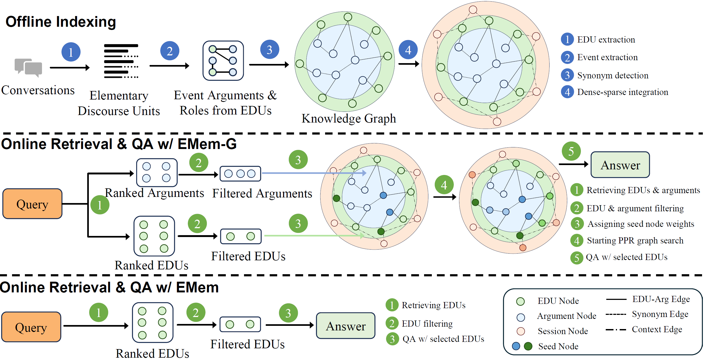

<h1 align="center">EMem: A Simple Yet Strong Baseline for Long-Term Conversational Memory of LLM Agents</h1>

<p align="center">
    <a href="https://arxiv.org/abs/2511.17208"></a>
</p>

<p align="center">
    
</p>


EMem is a structured memory system designed to enable LLM-based conversational agents to maintain coherent, personalized interactions over extended multi-session dialogues. Unlike approaches that compress or chunk conversation history, EMem preserves information in a non-lossy form by decomposing each session into enriched **Elementary Discourse Units (EDUs)** — self-contained propositions with normalized entities and source turn attributions.

Key features:
- **Fine-grained, proposition-level representation**: Conversational history is decomposed into EDUs — atomic statements that bundle participants, temporal cues, and minimal local context (inspired by neo-Davidsonian semantics where propositions capture facts, states, and relations)
- **Heterogeneous graph organization** (optional): Sessions, EDUs, and their arguments are organized in a graph that supports associative recall
- **Two retrieval variants**: 
  - **EMem**: A simple "Dense similarity search + LLM filtering" over EDUs
  - **EMem-G**: Adds graph-based Personalized PageRank (PPR) propagation to connect and aggregate evidence across related EDUs
- **Efficient QA context**: Achieves strong performance with significantly shorter QA contexts compared to baselines

## 📰 News

- **[2025.12]** We open-source the EMem codebase on LoCoMo and LongMemEval benchmarks.

## 📑 Table of Contents

- [News](#-news)
- [TODO](#-todo)
- [Installation](#-installation)
- [Dataset Preparation](#-dataset-preparation)
- [Reproducing Experiments](#-reproducing-experiments)
  - [Running EMem vs EMem-G](#running-emem-vs-emem-g)
  - [LoCoMo Evaluation](#locomo-evaluation)
  - [LongMemEval Evaluation](#longmemeval-evaluation)
  - [Final Evaluation for Paper Reporting](#final-evaluation-for-paper-reporting)
- [Citation](#-citation)

## ✅ TODO

- [ ] Further refine the codebase and enhance the efficiency
- [ ] Add support for additional benchmarks
- [ ] Add documentation for custom dataset integration

## 🔧 Installation

### Prerequisites

- Python 3.10+
- [uv](https://docs.astral.sh/uv/) - Fast Python package installer and resolver

### Install uv

If you don't have `uv` installed, you can install it via:

```bash
# On macOS and Linux
curl -LsSf https://astral.sh/uv/install.sh | sh

# Or using pip
pip install uv
```

### Install Dependencies

```bash
# Clone the repository
git clone https://github.com/KevinSRR/EMem.git
cd EMem

# Install all dependencies using uv
make install
```

This will install all required packages and download necessary NLTK data.

### Environment Variables

Set your OpenAI API key before running experiments:

```bash
export OPENAI_API_KEY="your-openai-api-key"
```

## 📦 Dataset Preparation

Before running experiments, download and place the evaluation datasets in the appropriate directories.

### LoCoMo Dataset

Download `locomo10.json` from the official LoCoMo repository:

```bash
# Create data directory if it doesn't exist
mkdir -p data

# Download LoCoMo dataset
wget -O data/locomo10.json \
  https://raw.githubusercontent.com/snap-research/locomo/main/data/locomo10.json
```

Source: [snap-research/locomo](https://github.com/snap-research/locomo/blob/main/data/locomo10.json)

### LongMemEval Dataset

Download `longmemeval_s_cleaned.json` from Hugging Face:

```bash
# Create directory structure
mkdir -p data/longmemeval/preprocess

# Download LongMemEval dataset (requires huggingface-hub or manual download)
# Option 1: Using huggingface-cli
huggingface-cli download xiaowu0162/longmemeval-cleaned longmemeval_s_cleaned.json \
  --local-dir data/longmemeval/preprocess

# Option 2: Manual download from browser
# Visit: https://huggingface.co/datasets/xiaowu0162/longmemeval-cleaned/tree/main
# Download longmemeval_s_cleaned.json and place it in data/longmemeval/preprocess/
```

Source: [xiaowu0162/longmemeval-cleaned](https://huggingface.co/datasets/xiaowu0162/longmemeval-cleaned/tree/main)

### Expected Directory Structure

```
EMem/
├── data/
│   ├── locomo10.json
│   └── longmemeval/
│       └── preprocess/
│           └── longmemeval_s_cleaned.json
```

## 🧪 Reproducing Experiments

### Running EMem vs EMem-G

EMem provides two model variants:

| Variant | Description | Command Flag |
|---------|-------------|--------------|
| **EMem-G** (default) | Uses PPR graph propagation for retrieval | (none) |
| **EMem** | Skips PPR step, retrieves filtered EDUs directly | `--skip_retrieval_ppr` |

*Note that with `--skip_retrieval_ppr`, we still build the same graph before retrieval even though the graph is redundant for EMem. We are working to remove this dependency.

### LoCoMo Evaluation

Run evaluation on the LoCoMo benchmark:

```bash
# EMem-G (with PPR) - default
make eval-locomo

# EMem (without PPR)
make eval-locomo-emem
```

**Optional parameters:**
```bash
# Use a different LLM model
make eval-locomo LLM_MODEL=gpt-4o

# Use a different embedding model
make eval-locomo EMBEDDING_MODEL=text-embedding-3-large

# Custom save frequency
make eval-locomo LOCOMO_SAVE_FREQUENCY=50
```

Final prediction results (pickle files) will be saved to `results/`. Intermediate artifacts (LLM cache, graph indices, traces) will be saved to `outputs/emem_locomo_eval/`.

### LongMemEval Evaluation

Run evaluation on the LongMemEval benchmark:

```bash
# EMem-G (with PPR) - default
make eval-longmemeval

# EMem (without PPR)
make eval-longmemeval-emem
```

**Advanced options:**

The LongMemEval dataset is large, so we provide a pre-caching option that batch-calls LLM APIs for EDU extraction and event extraction across all test samples before running the full evaluation. This helps improve the speed.

```bash
# Only pre-cache API calls
make eval-longmemeval-precache

# Skip pre-caching (use existing cache)
make eval-longmemeval-skip-precache
```

Final prediction results (pickle files) will be saved to `results/`. Intermediate artifacts (LLM cache, graph indices, traces) will be saved to `outputs/emem_longmemeval_eval/`.

### Final Evaluation for Paper Reporting

After running the main evaluation workflows, use the final evaluation commands to compute standardized metrics for paper reporting. This includes:
- **LLM Judge scores** (multiple runs for mean ± std)
- **BLEU-1**, **F1**, and **Exact Match (EM)** scores

```bash
# For LoCoMo results
make final-eval-locomo RESULT_FILE=results/emem_locomo_results_xxx.pkl NUM_RUNS=3

# For LongMemEval results
make final-eval-longmemeval RESULT_FILE=results/emem_longmemeval_results_xxx.pkl NUM_RUNS=3
```

**Parameters:**
- `RESULT_FILE`: Path to the pickle file containing model predictions and ground truth references (required)
- `NUM_RUNS`: Number of independent LLM judge runs for computing mean and std (default: 3)
- `MAX_CONCURRENT`: Maximum concurrent API requests (default: 50)

Final evaluation results (JSON with detailed metrics) will be saved to the same directory as the input `RESULT_FILE`.

## 📄 Citation

If you find this work useful, please consider citing our paper:

```bibtex
@article{zhou2025simple,
  title={A Simple Yet Strong Baseline for Long-Term Conversational Memory of LLM Agents},
  author={Zhou, Sizhe},
  journal={arXiv preprint arXiv:2511.17208},
  year={2025}
}
```

---

Please feel free to open an issue or PR if you have any questions or suggestions.
